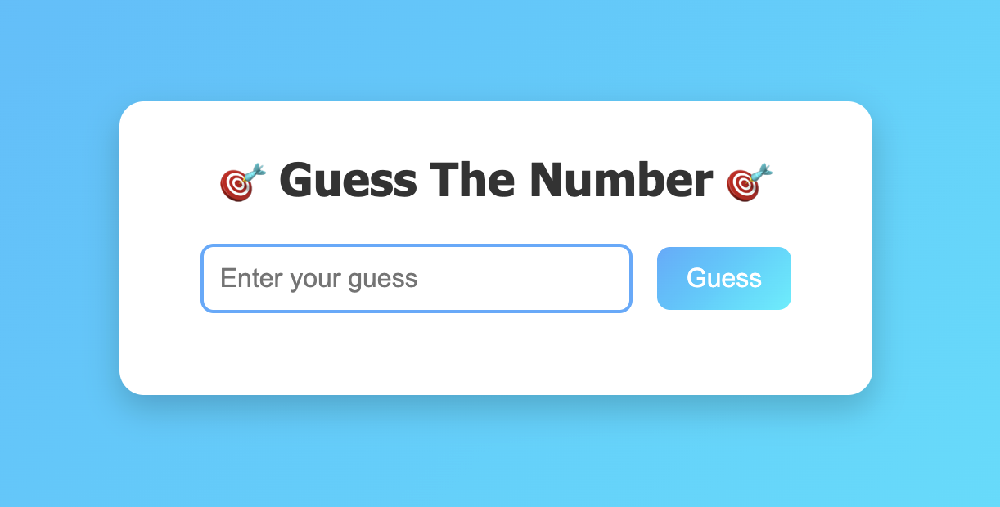

# 🎯 Guess The Number – A Fun Mini Game  https://guessthenumber.tiiny.site

This is a simple and interactive number guessing game built with **HTML, CSS, and JavaScript**.  
The computer randomly selects a number between **1 and 100**, and the player has to guess it in as few attempts as possible.

---

## ✨ Features
- 🎨 Clean and modern UI with gradient background and animations  
- 🔢 Random number generation on each refresh  
- 📊 Keeps track of total attempts  
- 🎉 Fun feedback messages with emojis (too high, too low, correct)  
- 💻 100% responsive and lightweight  

---

## 🚀 How to Play
1. Enter your guess in the input box.  
2. Click on the **Guess** button.  
3. Get instant feedback whether your guess is **too high, too low, or correct**.  
4. Keep guessing until you win! 🎉  

---

## 🛠️ Tech Stack
- **HTML** – structure  
- **CSS** – styling & animations  
- **JavaScript** – game logic  

---

## 📸 Screenshot

